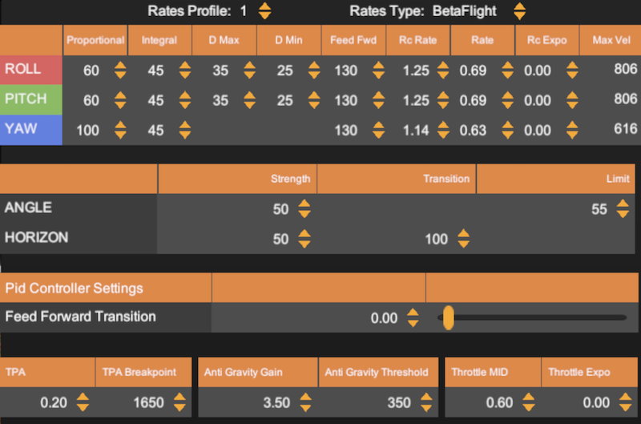
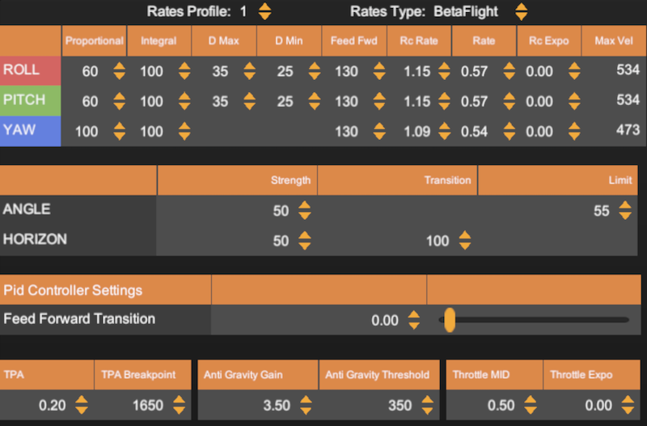
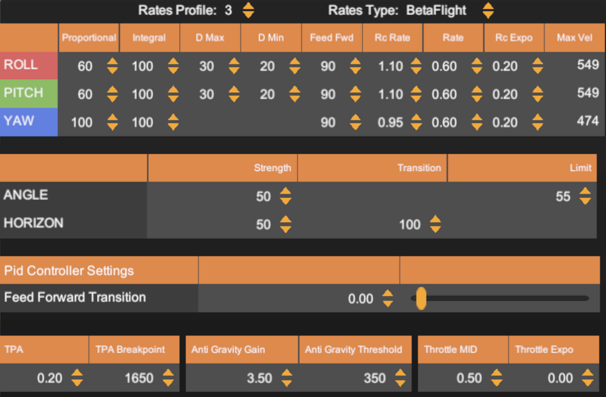

# Velocidrone rates

## Racing rates "spec" (TBS Spec)

## Racing rates "open" (Five33 Switchback)

Prop: 5150 or 5146
Prop profile:
 * Profile 1 seems faster
 * Profile 2 better for tight turns (?)

## Cinematic rates

